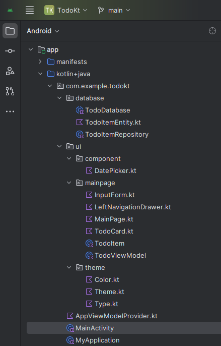

# todo_app_kotlin_jetpack_compose_room
 
> [!NOTE]
> 
> Todo app, Kotlin + Jetpack Compose + Room database

> [!NOTE]
> 
> Floating action button in right corner, click to open a bottom sheet
>
> Select date and time, confirm, todo item added and show in home page
>
> Long click todo item, show delete dialog, confirm to delete

